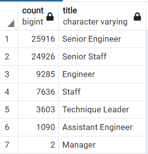
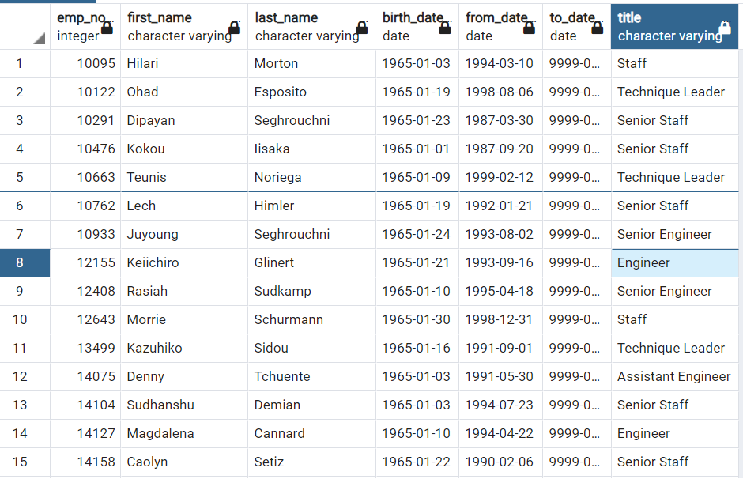
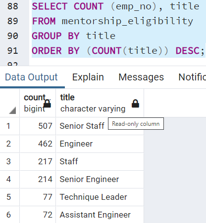

 Pewlett-Hackard_Analysis

## Overview of Project

### Purpose
The purpose of this project is to determine the number of retiring employees per title, and identify employees who are eligible to participate in a mentorship program.

## Results
From this analysis, we can conclude four major points:
* There are a lot of senior leadership that is eligible to retire.
* There are 41,380 employees that are eligible to retire with a hiring date between 01/01/1985 - 12/31/1988 with a birthdate that range from 01/01/1952 - 12/31/1955.
* The department that will be affected the most by the silver tsunami is the Senior Engineer staff.
* There is 1,549 employees who are eligible to mentor employees in Pewlett Hackard.
 
 
 
 
 
 
## Summary
There are 72,458 number of roles that need to be filled as the silver tsunami begins to make an impact.
There are not enough qualified, retirement-ready employees in the department to mentor the next generation of Pewlett Hackard employees.
When examining the employees table, we noticed that there are no employees that was born in the 1970s; therefore the management needs to hire younger employees so the company will not experience a silver tsunami.

